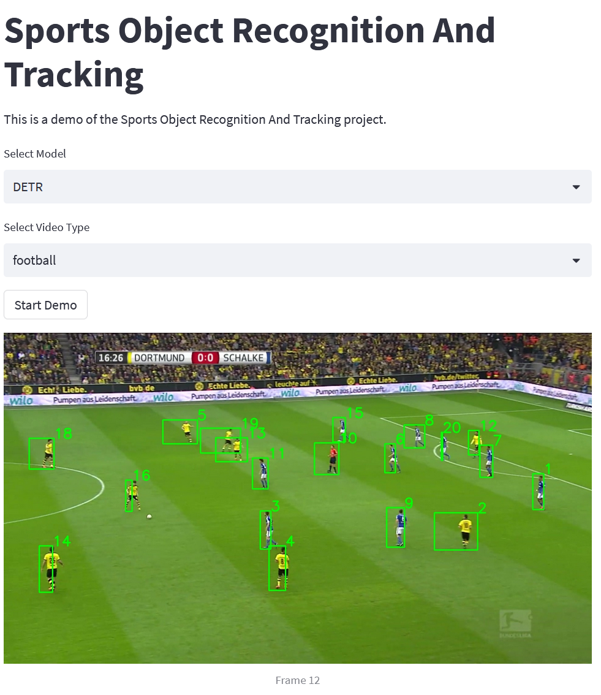

# SPORT
Sports Object Recognition and Tracking

## Requirements
- Python 3.11 or higher

## Setup Environment (Optional but recommended)
Create a virtual environment
```bash
python -m venv .venv
```

Activate the virtual environment
For windows
```bash
.venv\Scripts\activate.bat
```

For Linux
```bash
source .venv/bin/activate
```

## Installation
```bash
pip install -e . -r requirements.txt
```

## Dataset
SportsMOT: A Large Multi-Object Tracking Dataset in Multiple Sports Scenes

Download link: https://codalab.lisn.upsaclay.fr/competitions/12424

Unzip the dataset and put it in the `sport/dataset` folder.

The folder structure should look like this:
```
sport
├── dataset
│   ├── sportsmot_publish
│   │   ├── dataset
│   │   ├── scripts
│   │   ├── splits_txt
```

If your dataset is in a different location or structure, you can change the path using the cmd argument `--dataset_dir <path_to_dataset>` for example: `--dataset_dir /dataset/sportsmot_publish`

## Demo
This demo will run the object detection and tracking on a video file from the dataset and display the result in a web app. 
The demo allows you to select the sport and the model to use for object detection and tracking.
```bash
python streamlit run sport/cli/demo.py
```

<!-- Add image of the web app from folder `images` -->


## Inference
This command will run the object detection and tracking on a video file from the dataset and save the result in a text file.
```bash
sport infer --video_name <video_name>
```

## Training
This command will train the object detection and tracking model.
```bash
sport train
```

For training on a different model(DETR or ConditionalDETR):
```bash
sport train --model <model_name>
```

Other arguments:
- `--dataset_dir <path_to_dataset>`: Path to the dataset folder
- `--batch_size <batch_size>`: Batch size
- `--num_workers <num_workers>`: Number of workers for data loading
- `--epochs <epochs>`: Number of epochs
- `--lr <lr>`: Learning rate
- `--weight_decay <weight_decay>`: Weight decay

Other arguments can be found using `sport train --help`

## References

[1] SportsMOT: A Large Multi-Object Tracking Dataset in Multiple Sports Scenes
\[[arXiv](https://arxiv.org/abs/2109.14834)\]
